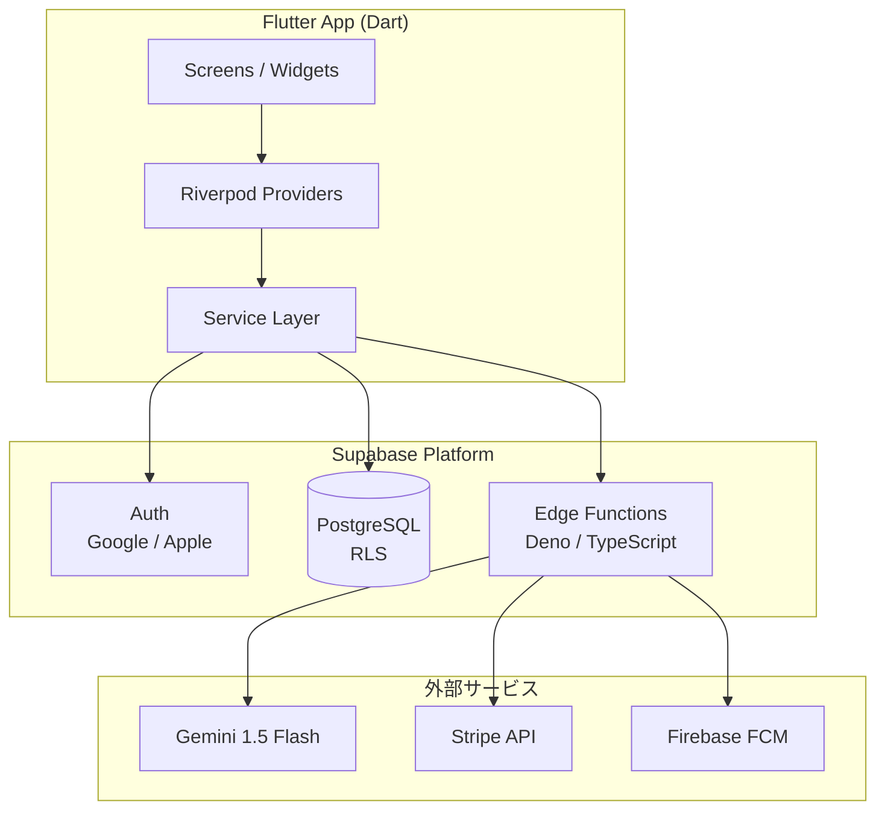
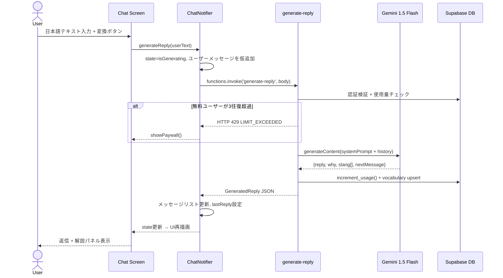

# Design Document — RizzLang Flutter MVP

## Overview

RizzLang は、Dart/Flutter で実装するモバイル言語学習アプリである。Supabase Edge Functions（Deno/TypeScript）が Gemini 1.5 Flash を呼び出すことで、AI 生成ロジックをサーバーサイドに完全隔離する。Flutter アプリは Riverpod によるリアクティブな状態管理と GoRouter によるナビゲーションを基盤とし、Supabase Flutter SDK で認証・DB・Edge Functions を統一的に扱う。

**ユーザー:** K-pop / K-drama ファンを主とする25-35歳の日本語話者

**影響:** 「感情が動く文脈での言語習得」というカテゴリを新設し、DAU 40%・7日リテンション 50% を目指す。AIコストは Gemini 1.5 Flash の無料枠（1,500 req/day）でBETA 100人規模をカバーする。

### Goals
- Edge Function 経由のAI生成を3秒以内（P95）で返す
- API キー類を Flutter バンドルに一切含めない
- Season 1（30日分）シナリオで学習継続率を担保する
- Stripe + flutter_stripe でフリーミアム収益化を実現する

### Non-Goals
- Web アプリ — v2スコープ
- 英語以外の第3言語（中国語・フランス語等）— v1.1スコープ
- リアルタイム音声通話
- ユーザー間ソーシャル機能

---

## Architecture

### Architecture Pattern & Boundary Map



**選択パターン:** Feature-First + Riverpod
- `features/` 以下に auth / chat / scenario / vocabulary / settings を配置
- `core/` に models / services / providers / theme / utils を配置
- Riverpod StateNotifier が UI ↔ Service 間の唯一の通信路
- APIキー類は Edge Functions の環境変数にのみ存在

### Technology Stack

| Layer | 技術 / Version | 役割 |
|-------|---------------|------|
| UI | Flutter 3.19 (Dart 3.3) | iOS / Android アプリ |
| 状態管理 | flutter_riverpod 2.5 + riverpod_annotation | リアクティブ状態 |
| ナビゲーション | go_router 13 | 宣言的ルーティング + 認証ガード |
| DB / Auth | supabase_flutter 2.5 | PostgreSQL + RLS + Auth |
| AI バックエンド | Supabase Edge Functions (Deno) | Gemini呼び出しをカプセル化 |
| AI モデル | Gemini 1.5 Flash | 無料枠: 1,500 req/day / 有料: $0.075/1M tokens |
| Google Auth | google_sign_in 6.2 | OAuth 2.0 |
| Apple Auth | sign_in_with_apple 6.1 | Apple Sign In |
| モデル生成 | freezed 2.5 + json_serializable | イミュータブルDTOコード生成 |
| 課金 | flutter_stripe 10 | Payment Sheet UI |
| 通知 | firebase_messaging 15 + firebase_core 3 | FCM |
| アニメーション | flutter_animate 4.5 + lottie 3.1 | メッセージ・報酬アニメ |

---

## System Flows

### チャット生成フロー（コア）



### GoRouter 認証ガード

```mermaid
flowchart TD
    A[アプリ起動] --> B{Supabase セッション\n存在？}
    B -- No --> C[/login へ redirect]
    B -- Yes --> D{オンボーディング\n完了？}
    D -- No --> E[/onboarding へ redirect]
    D -- Yes --> F[/chat へ遷移]
    C --> G[ログイン画面]
    G --> H{認証成功}
    H -- 初回 --> E
    H -- 既存 --> F
```

---

## Requirements Traceability

| 要件 | 概要 | コンポーネント | 主要インターフェース |
|------|------|---------------|-------------------|
| 1.1–1.6 | 認証・RLS | AuthNotifier, GoRouter redirect | signInWithGoogle(), signInWithApple() |
| 2.1–2.5 | オンボーディング | OnboardingFlow, DemoChat | generateDemoReply() Edge Function |
| 3.1–3.7 | AI生成 | ChatNotifier, AIService | generate-reply Edge Function |
| 4.1–4.6 | シナリオ | ScenarioService, ScenarioNotifier | getTodayScenario() |
| 5.1–5.5 | 難易度変動 | DifficultyService | calcNextLevel(), updateLevel() |
| 6.1–6.4 | 語彙帳 | VocabularyNotifier | upsertVocab(), getVocabList() |
| 7.1–7.4 | ストリーク | StreakService | updateStreak(), checkMilestone() |
| 8.1–8.6 | Stripe課金 | StripeService | create-checkout-session Edge Function |
| 9.1–9.4 | FCM通知 | PushNotificationService | daily-reminder Edge Function |
| 10.1–10.5 | 性能・セキュリティ | 全コンポーネント | RLS / Rate Limit / Cache |

---

## Components and Interfaces

### 要約テーブル

| Component | Domain | Intent | 要件 | 主要依存 |
|-----------|--------|--------|------|----------|
| AuthNotifier | Auth | Google/Apple 認証状態管理 | 1.1–1.5 | supabase_flutter, google_sign_in |
| ChatNotifier | Chat | AI生成フロー + メッセージ状態 | 3.1–3.7 | AIService, ScenarioService |
| AIService | Chat | Edge Function 呼び出し抽象 | 3.1, 3.6 | Supabase.functions |
| ScenarioService | Scenario | シーン選択・進捗管理 | 4.1–4.6 | Supabase.from('scenario_templates') |
| DifficultyService | Scenario | レベル自動計算 | 5.1–5.5 | Supabase.from('usage_logs') |
| VocabularyNotifier | Vocab | 語彙upsert・SRS管理 | 6.1–6.4 | Supabase.from('vocabulary') |
| StreakService | Streak | 連続日数更新・マイルストーン | 7.1–7.4 | Supabase.from('users') |
| StripeService | Billing | Checkout Session・Webhook処理 | 8.1–8.6 | create-checkout-session Edge Function |
| PushNotificationService | Notification | FCMトークン管理・通知許可 | 9.1–9.4 | firebase_messaging |

---

### Chat Layer

#### AIService

| Field | Detail |
|-------|--------|
| Intent | Supabase Edge Function への呼び出しをカプセル化し、APIキーをアプリバンドルから排除する |
| Requirements | 3.1, 3.2, 3.6 |

**Dependencies**
- Outbound: `Supabase.instance.client.functions` — invoke Edge Functions (P0)
- External: `generate-reply` / `generate-demo-reply` Edge Functions (P0)

**Contracts:** Service [x]

```dart
abstract class AIService {
  Future<GeneratedReply> generateReply({
    required String userText,
    required String conversationId,
    required List<MessageModel> history,
    required int userLevel,
    required String userCallName,
  });

  Future<GeneratedReply> generateDemoReply(String userText);
}

// エラー型
class AIServiceException implements Exception {
  final String message;
  final int? statusCode; // 429 = LIMIT_EXCEEDED
}
```

---

#### ChatNotifier (Riverpod StateNotifier)

| Field | Detail |
|-------|--------|
| Intent | 当日の会話状態管理・AI生成フロー・ペイウォールトリガー |
| Requirements | 3.1–3.7, 4.3 |

**Contracts:** State [x]

```dart
class ChatState {
  final List<MessageModel> messages;
  final GeneratedReply? lastReply;
  final bool isLoading;      // 初期ロード
  final bool isGenerating;   // AI生成中
  final bool showPaywall;    // 上限到達
  final String? error;
}

abstract class ChatNotifier extends StateNotifier<ChatState> {
  Future<void> generateReply(String userText);
  Future<void> sendReply();   // lastReply.reply を送信確定
  void dismissPaywall();
}
```

**Implementation Notes**
- `isGenerating = true` でボタン無効化 + ローディング表示（3.3）
- HTTP 429 受信時は `showPaywall = true` に切り替え（3.4, 8.1）
- 会話履歴は直近20件（10往復分）のみ Edge Function に送信してトークンコストを抑制（3.1）

---

### Scenario Layer

#### ScenarioService

| Field | Detail |
|-------|--------|
| Intent | 今日のシーン選択・進捗自動更新・時間帯別メッセージ選択 |
| Requirements | 4.1–4.6 |

```dart
abstract class ScenarioService {
  Future<ScenarioModel> getTodayScenario({
    required String userId,
    required String characterId,
    required int userLevel,
  });

  Future<void> advanceProgress(String userId, String characterId);
  Future<ScenarioProgress> getProgress(String userId, String characterId);
  String selectOpeningMessage(ScenarioModel scenario, int level, TimeOfDay time);
}

enum TimeOfDay { morning, afternoon, evening, night }
```

---

#### DifficultyService

| Field | Detail |
|-------|--------|
| Intent | 7日間の usage_logs から level を計算・更新 |
| Requirements | 5.1–5.5 |

```dart
abstract class DifficultyService {
  // noEditRate > 0.8 && avgRetries < 0.5 → +1
  // noEditRate < 0.4 || avgRetries > 2   → -1
  int calcNextLevel(int current, DifficultyMetrics metrics);
  Future<void> updateLevelIfNeeded(String userId);
}

class DifficultyMetrics {
  final double noEditRate;  // 0.0–1.0
  final double avgRetries;  // 往復あたり平均再生成回数
}
```

---

### Billing Layer

#### StripeService

| Field | Detail |
|-------|--------|
| Intent | flutter_stripe による Payment Sheet + Supabase Edge Function でサーバー側 Checkout を生成 |
| Requirements | 8.3–8.5 |

```dart
abstract class StripeService {
  Future<void> presentPaymentSheet(String userId);
  // Webhook 処理は Edge Function 側（Flutter は非関与）
}
```

**Edge Function API Contract**

| Method | Function名 | Request | Response | Errors |
|--------|-----------|---------|----------|--------|
| POST | `create-checkout-session` | `{userId}` | `{clientSecret, publishableKey}` | 400, 500 |
| POST | `stripe-webhook` | Stripe Event | `{received: true}` | 400 |

---

## Data Models

### Physical Data Model（主要テーブル）

```sql
users            (id, email, plan, stripe_customer_id, current_level,
                  user_call_name, streak, last_active, created_at)

characters       (id, name, language, persona jsonb, avatar_url)

conversations    (id, user_id, character_id, date, messages jsonb[], turns_used)
                 UNIQUE(user_id, character_id, date)

scenario_templates (id, character_id, arc_season, arc_week, arc_day,
                    scene_type, opening_message jsonb, vocab_targets jsonb)
                   UNIQUE(character_id, arc_season, arc_week, arc_day)

user_scenario_progress (user_id, character_id, current_season,
                        current_week, current_day, last_played_at)

vocabulary       (id, user_id, word, meaning, language,
                  learned_at, next_review, review_count, ease_factor)
                 UNIQUE(user_id, word, language)

usage_logs       (id, user_id, date, turns_used, edit_count, retry_count)
                 UNIQUE(user_id, date)

push_subscriptions (id, user_id, fcm_token, enabled, platform)
```

**インデックス:**
- `conversations(user_id, date)` — 当日セッション取得
- `vocabulary(next_review)` — SRS復習クエリ
- `usage_logs(user_id, date)` — 使用量チェック

### Dart DTOs（Freezed）

```dart
@freezed
class GeneratedReply with _$GeneratedReply {
  const factory GeneratedReply({
    required String reply,
    required String why,
    @Default([]) List<SlangItem> slang,
    required String nextMessage,
  }) = _GeneratedReply;
  factory GeneratedReply.fromJson(Map<String, dynamic> json) => ...;
}
```

---

## Error Handling

| カテゴリ | 原因 | Flutter側ハンドリング |
|---------|------|---------------------|
| HTTP 429 | 無料往復上限 | `showPaywall = true` → ボトムシート |
| HTTP 401 | セッション切れ | Supabase SDK 自動リフレッシュ → GoRouter redirect |
| HTTP 5xx | Edge Function 障害 | SnackBar「少し時間をおいて再試行してください」|
| JSON parse エラー | Gemini 不正レスポンス | フォールバック reply を表示 |
| ネットワーク切断 | オフライン | `connectivity_plus` で検知 → 「オフラインです」バナー |

---

## Testing Strategy

### Unit Tests
- `DifficultyService.calcNextLevel()` — 境界値（0.8 / 0.4 / 0.5 / 2.0）
- `ScenarioService.selectOpeningMessage()` — 4時間帯 × 4レベル
- `VocabularyModel` SM-2 `next_review` 計算
- `StreakService.updateStreak()` — 継続 / 断絶

### Widget Tests
- `ChatScreen` — isGenerating 時のボタン無効化確認
- `ReplyPanel` — slang リスト表示
- `StreakBar` — streak 値反映

### Integration Tests（Flutter Driver）
- オンボーディング → デモ → サインアップ → 初回チャット
- 無料上限 → ペイウォール表示
- シナリオ進捗 arc_day=7 → arc_week+1

---

## Security Considerations

- `--dart-define` で注入する値は Supabase URL / Anon Key のみ（公開可）
- Gemini API Key / Stripe Secret / Supabase Service Role Key は Edge Functions の `Deno.env` にのみ存在
- Supabase RLS ポリシーを全テーブルに適用（`auth.uid() = user_id`）
- Edge Function は毎リクエストで `auth.getUser(jwt)` を実行（3.3）
- flutter_stripe は PCI DSS Level 1 準拠。カード番号は Stripe サーバーにのみ送信

## Performance & Scalability

- Gemini 1.5 Flash 平均レイテンシ 1-2秒 → Edge Function オーバーヘッド込みで P95 3秒以内（10.1）
- `CachedNetworkImage` でキャラクターアバターをメモリ・ディスクキャッシュ（10.5）
- 無料枠（1,500 req/day）を超えた場合、Gemini 1.5 Flash 有料プランへ自動移行（約¥0.015/往復）
- Riverpod `keepAlive: true` で会話状態をセッション中保持し、再フェッチを最小化
