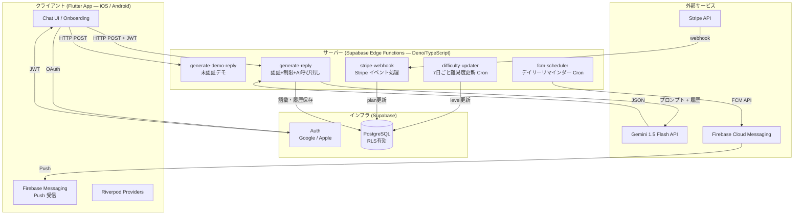
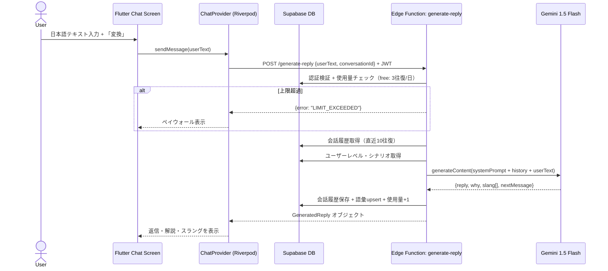
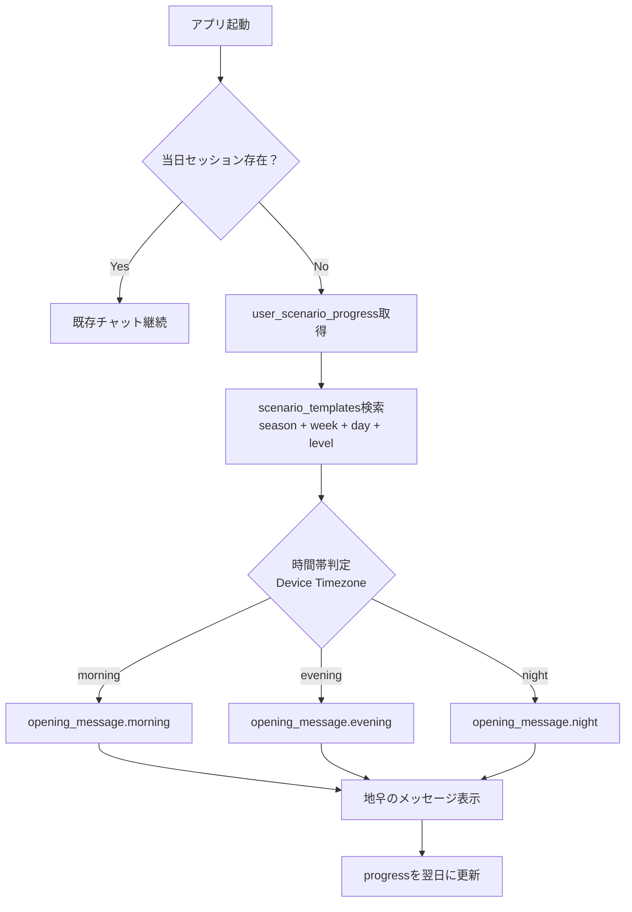
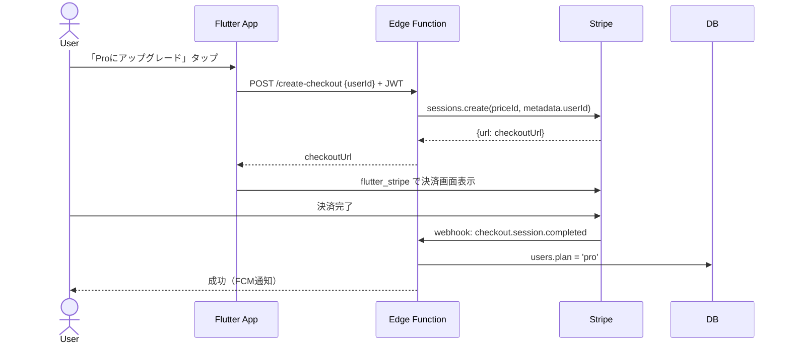

# Design Document — RizzLang MVP

## Overview

RizzLang はAIが動かす疑似恋愛シナリオを通じて、日本語話者が韓国語を自然な文脈で習得する **Flutter モバイルアプリ**である。ユーザーが日本語で「言いたいこと」を入力すると、Gemini 1.5 Flash がキャラクタープロンプト・会話履歴・難易度レベルを組み合わせて、自然な韓国語返信・解説・スラング情報・次の지우メッセージを1回のAPI呼び出しで生成する。

**ユーザー：** 韓国語を恋愛的な文脈で学びたい25-35歳の日本人（主にK-pop・K-dramaファン）

**影響：** 既存の語学学習アプリ（Duolingo等）と完全に異なるカテゴリを作る。感情的なリテンション構造により、DAU 40%・7日リテンション 50% を目指す。

### Goals
- AI生成（返信+解説）を3秒以内（P95）で返す
- 1日の利用コスト（AIトークン）を 0.015円/往復 以下に抑える（Gemini 1.5 Flash）
- Season 1（30日分）シナリオで学習継続率を担保する
- Stripe連携でフリーミアム収益化を実現する

### Non-Goals
- Web版 — v2スコープ（Flutter Web は対象外）
- 英語・中国語等の他言語 — v1.1スコープ
- リアルタイム音声通話機能
- ユーザー間のソーシャル機能

---

## Architecture

### Architecture Pattern & Boundary Map



**選択パターン：** Flutter + Supabase Edge Functions（BFF統合型）
- API キー類を Edge Functions に完全隔離（クライアントから不可視）
- Supabase RLS でデータアクセス制御を宣言的に管理
- Riverpod で UI 状態管理を型安全に実装

### Technology Stack

| Layer | 選択 / Version | 役割 | 備考 |
|-------|---------------|------|------|
| Frontend | Flutter 3.19 + Dart 3.3 | iOS / Android ネイティブアプリ | Material 3 ダークテーマ |
| 状態管理 | flutter_riverpod 2.x | UI状態・非同期処理 | CodeGen: riverpod_generator |
| ナビゲーション | go_router 14.x | 宣言的ルーティング + 認証ガード | |
| UI アニメーション | flutter_animate 4.x | トランジション・リアクション | |
| Auth | supabase_flutter + google_sign_in + sign_in_with_apple | Google / Apple OAuth | JWT をクライアントで保持 |
| DB | Supabase PostgreSQL | 全永続データ | RLS 必須 |
| Edge Functions | Deno + TypeScript | AI 呼び出し / Stripe Webhook | API キーをサーバー側に隔離 |
| AI | Google Gemini 1.5 Flash | チャット生成 | 無料枠: 1,500 req/day, 1M tokens/day |
| 決済 | flutter_stripe + Stripe Subscriptions | Pro課金 | Webhookでplan同期 |
| 通知 | firebase_messaging (FCM) + Supabase Edge Functions Cron | デイリーリマインダー | |
| Deploy | App Store + Google Play + Supabase | ホスティング | GitHub連携でCI/CD |

---

## System Flows

### チャット生成フロー（コアフロー）



### シナリオ選択フロー



### Stripe課金フロー



---

## Requirements Traceability

| 要件 | 概要 | コンポーネント | インターフェース |
|------|------|---------------|----------------|
| 1.1-1.5 | 認証・RLS | AuthProvider, Supabase RLS | supabase_flutter OAuth |
| 2.1-2.5 | オンボーディング | OnboardingScreen, DemoChat | Edge Function: generate-demo-reply |
| 3.1-3.7 | AIチャット生成 | ChatProvider, AiService | Edge Function: generate-reply |
| 4.1-4.6 | シナリオシステム | ScenarioService | getScenario(), advanceProgress() |
| 5.1-5.5 | 難易度変動 | DifficultyEngine | calcLevel(), updateLevel() |
| 6.1-6.5 | 語彙帳 | VocabularyService | upsertVocab(), getVocabList() |
| 7.1-7.5 | ストリーク | StreakService | updateStreak(), checkMilestone() |
| 8.1-8.6 | 課金 | StripeService, flutter_stripe | createCheckoutSession(), handleWebhook() |
| 9.1-9.5 | FCM Push通知 | firebase_messaging + Edge Cron | subscribe(), sendDailyReminder() |
| 10.1-10.5 | セキュリティ | 全コンポーネント | RLS, Rate Limit |

---

## Components and Interfaces

### Flutter Layer

#### ChatProvider (Riverpod)

| Field | Detail |
|-------|--------|
| Intent | チャット状態管理・AI呼び出しのオーケストレーション |
| Requirements | 3.1, 3.2, 3.3, 3.4, 3.5, 3.6, 3.7 |
| File | `lib/features/chat/providers/chat_provider.dart` |

```dart
// State
@freezed
class ChatState with _$ChatState {
  const factory ChatState({
    @Default([]) List<MessageModel> messages,
    @Default(false) bool isLoading,
    @Default(false) bool isLimitExceeded,
    String? errorMessage,
    GeneratedReply? lastReply,
  }) = _ChatState;
}

// Notifier
class ChatNotifier extends StateNotifier<ChatState> {
  Future<void> sendMessage(String userText);
  Future<void> loadHistory(String conversationId);
}
```

---

#### AiService

| Field | Detail |
|-------|--------|
| Intent | Supabase Edge Functions への HTTP 呼び出し |
| Requirements | 3.1, 3.5, 3.6 |
| File | `lib/core/services/ai_service.dart` |

```dart
class AiService {
  Future<GeneratedReply> generateReply({
    required String userText,
    required String conversationId,
  });

  Future<GeneratedReply> generateDemoReply(String userText);
}
```

**GeneratedReply モデル（Freezed）:**
```dart
@freezed
class GeneratedReply with _$GeneratedReply {
  const factory GeneratedReply({
    required String reply,        // 自然な韓国語返信
    required String why,          // 理由解説（30文字以内・日本語）
    @Default([]) List<SlangItem> slang,
    required String nextMessage,  // 地우の次のセリフ
  }) = _GeneratedReply;
}
```

---

### Edge Functions Layer

#### generate-reply (Deno/TypeScript)

| Field | Detail |
|-------|--------|
| Intent | Gemini APIへのリクエスト構築・送信・レスポンスパース |
| Requirements | 3.1, 3.2, 3.3, 3.4, 3.5, 3.6 |
| File | `supabase/functions/generate-reply/index.ts` |

**Responsibilities & Constraints**
- JWT 認証検証（`Authorization: Bearer <jwt>`）
- System Prompt にキャラクター定義・難易度・ユーザー呼称・時間帯を組み込む
- 直近10往復の会話履歴をコンテキストとして付与
- レスポンスは必ず `{reply, why, slang, nextMessage}` のJSON形式で返す
- API キーはサーバーサイド環境変数のみ（クライアント露出禁止）
- 無料ユーザー: 3ターン/日制限

**System Prompt テンプレート:**
```
あなたは{characterName}、{characterProfile}です。
現在、{userName}（{userCallName}）と付き合っています。

難易度レベル: {level}（1=初級短文 / 2=スラング入門 / 3=複合表現 / 4=ネイティブ感性）
時間帯: {timeOfDay}

性格と口調:
{characterPersonality}

会話ルール:
- 前の会話の文脈を必ず引き継ぐ
- 1メッセージ2〜3文が最大
- 難易度レベルに応じた語彙・文型を使用

レスポンスは必ず以下のJSON形式で返す:
{"reply":"...","why":"...（30文字以内）","slang":[{"word":"...","meaning":"..."}],"nextMessage":"..."}
```

---

#### ScenarioService（Edge Functions 内ユーティリティ）

| Field | Detail |
|-------|--------|
| Intent | シナリオDB管理・今日のシーン選択・進捗更新 |
| Requirements | 4.1, 4.2, 4.3, 4.4, 4.5, 4.6 |

```typescript
interface Scenario {
  id: string;
  arcSeason: number;
  arcWeek: number;
  arcDay: number;
  sceneType: 'daily' | 'emotional' | 'discovery' | 'event' | 'tension';
  openingMessage: Record<'lv1' | 'lv2' | 'lv3' | 'lv4', Record<TimeOfDay, string>>;
  vocabTargets: VocabTarget[];
  nextMessageHint: string;
}

type TimeOfDay = 'morning' | 'afternoon' | 'evening' | 'night';

interface ScenarioService {
  getTodayScenario(userId: string, characterId: string): Promise<Scenario>;
  advanceProgress(userId: string, characterId: string): Promise<void>;
  getProgress(userId: string, characterId: string): Promise<ScenarioProgress>;
}
```

---

#### DifficultyEngine（Edge Function Cron）

| Field | Detail |
|-------|--------|
| Intent | 7日間の学習データからレベルを自動計算・更新（Supabase Cron） |
| Requirements | 5.1, 5.2, 5.3, 5.4, 5.5 |
| File | `supabase/functions/difficulty-updater/index.ts` |

```typescript
interface DifficultyMetrics {
  noEditRate: number;    // 編集なし送信率（0-1）
  avgRetries: number;    // 平均リトライ数
}

// ロジック
// noEditRate > 0.8 && avgRetries < 0.5 → level + 1
// noEditRate < 0.4 || avgRetries > 2   → level - 1
// otherwise                             → level 維持
```

---

### Data Layer

#### VocabularyService（Flutter Provider + Supabase）

| Field | Detail |
|-------|--------|
| Intent | 語彙の自動保存・SRSスケジュール計算・復習リスト提供 |
| Requirements | 6.1, 6.2, 6.3, 6.4, 6.5 |
| File | `lib/features/vocabulary/providers/vocabulary_provider.dart` |

**SRSスケジュール（SM-2準拠）:**
```
reviewCount=0 → nextReview = +1日
reviewCount=1 → nextReview = +3日
reviewCount=2 → nextReview = +7日
reviewCount>=3 → nextReview = 前回間隔 × easeFactor
```

---

#### StreakService（Flutter Provider）

| Field | Detail |
|-------|--------|
| Intent | 連続ログイン管理・マイルストーン検出 |
| Requirements | 7.1, 7.2, 7.3, 7.4 |

```dart
class StreakNotifier extends StateNotifier<int> {
  Future<StreakResult> updateStreak(String userId);
  int? checkMilestone(int streak); // returns 7 | 30 | 100 | null
}
```

---

### Billing Layer

#### StripeService（Edge Functions）

| Field | Detail |
|-------|--------|
| Intent | Checkout Sessionの生成・Webhook処理・plan同期 |
| Requirements | 8.3, 8.4, 8.5 |

##### API Contract

| Method | Endpoint | Request | Response | Errors |
|--------|----------|---------|----------|--------|
| POST | /functions/v1/create-checkout | `{userId}` + JWT | `{url: string}` | 400, 500 |
| POST | /functions/v1/stripe-webhook | Stripe Event | `{received: true}` | 400 |

```typescript
interface StripeService {
  createCheckoutSession(userId: string): Promise<{ url: string }>;
  handleWebhook(event: Stripe.Event): Promise<void>;
}
// handleWebhookが処理するイベント:
// - checkout.session.completed → plan = 'pro'
// - customer.subscription.deleted → plan = 'free'
```

---

## Data Models

### Physical Data Model

```sql
-- ユーザー
CREATE TABLE users (
  id              uuid PRIMARY KEY DEFAULT gen_random_uuid(),
  email           text UNIQUE NOT NULL,
  plan            text NOT NULL DEFAULT 'free' CHECK (plan IN ('free', 'pro')),
  stripe_customer_id text,
  current_level   int NOT NULL DEFAULT 1 CHECK (current_level BETWEEN 1 AND 4),
  user_call_name  text NOT NULL DEFAULT 'オッパ',  -- 地우からの呼び方
  streak          int NOT NULL DEFAULT 0,
  last_active     date,
  created_at      timestamptz NOT NULL DEFAULT now()
);

-- キャラクター（シードデータ）
CREATE TABLE characters (
  id          uuid PRIMARY KEY DEFAULT gen_random_uuid(),
  name        text NOT NULL,        -- 'ジウ'
  language    text NOT NULL,        -- 'ko'
  persona     jsonb NOT NULL,       -- systemPrompt含む全人格設定
  avatar_url  text
);

-- 会話セッション（1日1レコード）
CREATE TABLE conversations (
  id            uuid PRIMARY KEY DEFAULT gen_random_uuid(),
  user_id       uuid NOT NULL REFERENCES users(id) ON DELETE CASCADE,
  character_id  uuid NOT NULL REFERENCES characters(id),
  date          date NOT NULL DEFAULT CURRENT_DATE,
  messages      jsonb NOT NULL DEFAULT '[]',  -- Message[]
  turns_used    int NOT NULL DEFAULT 0,
  UNIQUE(user_id, character_id, date)
);

-- シナリオテンプレート
CREATE TABLE scenario_templates (
  id              uuid PRIMARY KEY DEFAULT gen_random_uuid(),
  character_id    uuid NOT NULL REFERENCES characters(id),
  arc_season      int NOT NULL,
  arc_week        int NOT NULL,
  arc_day         int NOT NULL,
  scene_type      text NOT NULL CHECK (scene_type IN ('daily','emotional','discovery','event','tension')),
  opening_message jsonb NOT NULL,  -- {lv1: {morning:.., evening:..}, lv2: ...}
  vocab_targets   jsonb NOT NULL DEFAULT '[]',
  next_message_hint text,
  UNIQUE(character_id, arc_season, arc_week, arc_day)
);

-- シナリオ進捗
CREATE TABLE user_scenario_progress (
  user_id       uuid NOT NULL REFERENCES users(id) ON DELETE CASCADE,
  character_id  uuid NOT NULL REFERENCES characters(id),
  current_season int NOT NULL DEFAULT 1,
  current_week   int NOT NULL DEFAULT 1,
  current_day    int NOT NULL DEFAULT 1,
  last_played_at timestamptz,
  PRIMARY KEY (user_id, character_id)
);

-- 語彙帳
CREATE TABLE vocabulary (
  id            uuid PRIMARY KEY DEFAULT gen_random_uuid(),
  user_id       uuid NOT NULL REFERENCES users(id) ON DELETE CASCADE,
  word          text NOT NULL,
  meaning       text NOT NULL,
  example       text,
  language      text NOT NULL,
  learned_at    timestamptz NOT NULL DEFAULT now(),
  next_review   timestamptz NOT NULL DEFAULT now() + interval '1 day',
  review_count  int NOT NULL DEFAULT 0,
  ease_factor   float NOT NULL DEFAULT 2.5,
  UNIQUE(user_id, word, language)
);

-- 使用量ログ（難易度計算・制限管理用）
CREATE TABLE usage_logs (
  id            uuid PRIMARY KEY DEFAULT gen_random_uuid(),
  user_id       uuid NOT NULL REFERENCES users(id) ON DELETE CASCADE,
  date          date NOT NULL DEFAULT CURRENT_DATE,
  turns_used    int NOT NULL DEFAULT 0,
  edit_count    int NOT NULL DEFAULT 0,    -- 難易度計算用
  retry_count   int NOT NULL DEFAULT 0,   -- 難易度計算用
  character_id  uuid REFERENCES characters(id),
  UNIQUE(user_id, date)
);

-- FCM デバイストークン
CREATE TABLE fcm_tokens (
  id            uuid PRIMARY KEY DEFAULT gen_random_uuid(),
  user_id       uuid NOT NULL REFERENCES users(id) ON DELETE CASCADE,
  token         text NOT NULL,
  platform      text NOT NULL CHECK (platform IN ('ios', 'android')),
  enabled       boolean NOT NULL DEFAULT true,
  created_at    timestamptz NOT NULL DEFAULT now(),
  UNIQUE(user_id, token)
);

-- RLSポリシー（全テーブル共通）
ALTER TABLE users ENABLE ROW LEVEL SECURITY;
ALTER TABLE conversations ENABLE ROW LEVEL SECURITY;
ALTER TABLE vocabulary ENABLE ROW LEVEL SECURITY;
ALTER TABLE usage_logs ENABLE ROW LEVEL SECURITY;
ALTER TABLE fcm_tokens ENABLE ROW LEVEL SECURITY;
-- 各テーブルに: USING (auth.uid() = user_id)
```

---

## Error Handling

### Error Strategy

| カテゴリ | 原因 | ハンドリング |
|---------|------|------------|
| AIエラー (5xx) | Gemini APIタイムアウト / レート制限 | Edge Function 内で3回リトライ（exponential backoff）→ Flutter 側で日本語エラー表示 |
| 制限超過 (429) | 無料ユーザーの往復上限 | `LIMIT_EXCEEDED`を返しFlutter側でペイウォールBottomSheet表示 |
| 認証エラー (401) | JWTの期限切れ | supabase_flutter が自動リフレッシュ、失敗時は GoRouter redirect でログイン画面へ |
| JSONパースエラー | Gemini の不正レスポンス | フォールバック: `{reply: "もう一度試してください", why: "", slang: [], nextMessage: "..."}` |
| Stripe Webhook重複 | 同一イベントの複数配信 | idempotency key（イベントID）でDB側で重複排除 |
| ネットワークエラー | モバイル回線断 | DioException をキャッチし Flutter 側でリトライ促進 Toast 表示 |

### Monitoring
- Firebase Crashlytics でクラッシュ・エラートラッキング（自動）
- Supabase Dashboard で DB 接続・クエリ監視
- Firebase Performance Monitoring でネットワークリクエスト計測

---

## Testing Strategy

### Unit Tests（`flutter_test`）
- `DifficultyEngine.calcNextLevel()` — 境界値（0.8/0.4の閾値）
- `VocabularyService` SRSスケジュール計算（SM-2アルゴリズム）
- `ChatProvider` メッセージ送信フロー（Mockito でAiService をモック）
- `StreakNotifier.updateStreak()` — 連続/断絶の両ケース

### Widget Tests（`flutter_test`）
- `MessageBubble` — ユーザー/キャラクター吹き出しの表示確認
- `ReplyPanel` — 解説・スラングパネルの展開/折りたたみ
- `StreakBar` — ストリーク数値の表示・マイルストーンアニメーション

### Integration Tests（`integration_test`）
- オンボーディング → デモ体験 → サインアップ → 初回チャット の完全フロー
- 無料上限（3往復）到達 → ペイウォールBottomSheet表示 の確認
- ストリーク更新 → StreakBar UI反映 の確認

---

## Security Considerations

- **APIキー管理：** GEMINI_API_KEY / STRIPE_SECRET_KEY / SUPABASE_SERVICE_ROLE_KEY は Supabase Edge Functions の Secrets に設定。Flutter クライアントには `SUPABASE_URL` と `SUPABASE_ANON_KEY` のみ（`--dart-define` または `env.dart` で管理）。
- **RLS：** 全テーブルに `auth.uid() = user_id` ポリシー。Service Role Key は Edge Functions のみ使用。
- **レート制限：** ユーザーごとに1分10リクエスト上限。`usage_logs`の1分間ウィンドウで検証（Edge Function 内）。
- **Webhook検証：** Stripe Signature を `stripe.webhooks.constructEvent()` で必ず検証。
- **JWT検証：** 全 Edge Function の先頭で `supabaseClient.auth.getUser(jwt)` を実行。

## Performance & Scalability

- **AI応答：** Gemini 1.5 Flash の平均レスポンス 1-2秒。Edge Function でJSONストリーミングは行わず、完全レスポンス待ち（シンプル優先）。Flutter 側はスケルトンローディングで体感速度を改善。
- **DB：** `conversations.date` + `user_id` に複合インデックス。`vocabulary.next_review` にインデックス（SRS復習クエリ最適化）。
- **スケール：** 無料枠（1,500 req/day）を超えた場合、Gemini 1.5 Flash 有料プランへ移行（$0.075/1M tokens）。
- **Flutter ビルド最適化：** `flutter build appbundle --release --obfuscate --split-debug-info` でリリースビルド。Tree shaking 有効。

---

## UI/UX 洗練化（2026-02-27）

### Emotional Dark テーマ

**カラーシステム:**
- Background: `#09090F` (midnight indigo) / Surface 3段階: `#13131F` → `#1C1C2E` → `#252540`
- Primary: `#FF4E8B` (confident rose) with `primaryGlow` (#FF4E8B @ 12%) and `borderGlow` (#FF4E8B @ 25%)
- Semantic: `tension` #FF6B6B / `success` #4ECDC4 / `gold` #FFD166
- Text: `text1` 95% / `text2` 65% / `text3` 38% (全てwhite透過)

**シャドウ:**
- `primaryShadow`: primary @ 30%, blurRadius 16, offset (0,4)
- `cardShadow`: black @ 30%, blurRadius 12, offset (0,2)

### MessageBubble
- キャラクター: surface2 + borderGlow 円形アバター + borderRadius(18,18,18,4) + cardShadow
- ユーザー: primaryGradient + borderRadius(18,4,18,18) + primaryShadow
- 250ms fadeIn + slideY(0.05) アニメーション

### ChatScreen 添削モード
- `_ModeToggleButton`: 36×36円形、モード切り替えアニメーション
- `_SendButton`: 40×40円形、isCheckMode時はorange-pink gradient
- 入力フィールド: AnimatedContainer、添削モード時にprimary border

### WritingCheckPanel（新規）
- CircularProgressIndicator スコアリング（success/gold/tension 色分け）
- tensionBg背景のエラー行（lineThrough→success 色分け）
